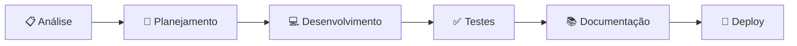

<div align="center">

# 👨‍💻 Rafael Mangabeira


</div>

---

##  Sobre Mim


```javascript
const rafael = {
    codigo: ["Java", "Python", "C#", "JavaScript", "Dart"],
    tecnologias: {
        backend: ["Spring Boot", "Node.js", ".NET Core", "FastAPI"],
        mobile: ["Flutter", "React Native"],
        frontend: ["React", "HTML5", "CSS3"],
        database: ["MySQL", "PostgreSQL", "MongoDB"],
        devOps: ["Git", "Docker", "CI/CD"]
    },
    foco: ["Backend Development", "Mobile Apps", "REST APIs"],
    objetivo: "Criar soluções que impactam vidas reais",
    disponivel: true
};
```

<br clear="both">

💼 Desenvolvedor com foco em **Backend** e **Mobile**, apaixonado por criar soluções escaláveis e de alto impacto.

🎯 Especializado em **APIs REST**, **Microserviços** e **Aplicações Mobile** multiplataforma.

🚀 Compromisso com **código limpo**, **boas práticas** e **entrega de qualidade**.

📚 Sempre aprendendo e explorando novas tecnologias para resolver problemas complexos.

---

##  Competências Técnicas & Comportamentais

<table>
<tr>
<td width="50%" valign="top">

### 💻 Hard Skills

```python
skills = {
    "Backend": [
        "✅ APIs REST & RESTful",
        "✅ Arquitetura Limpa & SOLID",
        "✅ Microserviços",
        "✅ Autenticação & Segurança"
    ],
    "Mobile": [
        "✅ Flutter & Dart",
        "✅ React Native",
        "✅ Apps Multiplataforma",
        "✅ UI/UX Responsivo"
    ],
    "Database": [
        "✅ Modelagem de Dados",
        "✅ SQL & NoSQL",
        "✅ Otimização de Queries",
        "✅ Redis & Cache"
    ]
}
```

</td>
<td width="50%" valign="top">

### 🎯 Soft Skills

<br>

- 🧠 **Resolução de Problemas Complexos**
- 📊 **Análise & Tomada de Decisão**
- 🤝 **Comunicação Clara & Assertiva**
- ⚡ **Adaptabilidade & Aprendizado Rápido**
- 📚 **Autodidatismo & Proatividade**
- 🔍 **Atenção aos Detalhes**
- ⏰ **Gestão de Tempo & Prazos**
- 👥 **Trabalho em Equipe**

<br>

</td>
</tr>
</table>

---

##  Stack Tecnológico

<div align="center">

### Backend & APIs
<p>
  
  
  
  
  
  
</p>

### Mobile Development
<p>
  
  
  
</p>

### Frontend & Web
<p>
  
  
  
  
</p>

### Database & Storage
<p>
  
  
  
  
</p>

### Ferramentas & DevOps
<p>
  
  
  
  
  
</p>

</div>

---

##  Estatísticas GitHub

<div align="center">
  
  
</div>

<div align="center">
  
  <br><br>
  
</div>


<br>

<div align="center">
  
</div>


---

##  Projetos em Destaque

<table>
<tr>
<td width="50%">

<h3 align="center">🏥 Medical Appointment System</h3>

<div align="center">  


<p>Backend robusto para agendamento de consultas médicas com gestão completa de pacientes, médicos e horários.</p>

<a href="https://github.com/RafaelManga/medical-appointment-system" target="_blank">

</a>
</div>

</td>

<td width="50%">

<h3 align="center">💬 Realtime Chat App</h3>

<div align="center">


<p>Backend de chat em tempo real usando WebSocket para comunicação instantânea entre usuários.</p>

<a href="https://github.com/RafaelManga/realtime-chat-app" target="_blank">

</a>
</div>

</td>
</tr>

<tr>
<td width="50%">

<h3 align="center">📱 Habit Tracker Mobile</h3>

<div align="center">


<p>App mobile multiplataforma para rastrear hábitos diários com interface intuitiva e notificações push.</p>

<a href="https://github.com/RafaelManga/habit-tracker-mobile" target="_blank">

</a>
</div>

</td>

<td width="50%">

<h3 align="center">🛒 Product Admin Panel</h3>

<div align="center">


<p>Sistema completo de gerenciamento de produtos com autenticação, dashboard e controle de estoque.</p>

<a href="https://github.com/RafaelManga/product-admin-panel" target="_blank">

</a>
</div>

</td>
</tr>

<tr>
<td width="50%">

<h3 align="center">💱 Currency Converter API</h3>

<div align="center">


<p>API REST para conversão de moedas com taxas atualizadas em tempo real e cache otimizado.</p>

<a href="https://github.com/RafaelManga/currency-converter-api" target="_blank">

</a>
</div>

</td>

<td width="50%">

<h3 align="center">✅ Task Manager API</h3>

<div align="center">


<p>API REST documentada com Swagger para gerenciamento eficiente de tarefas e projetos.</p>

<a href="https://github.com/RafaelManga/task-manager-api" target="_blank">

</a>
</div>

</td>
</tr>
</table>

<div align="center">

### 🔗 Mais Projetos

| Projeto | Descrição | Stack |
|---------|-----------|-------|
| [Streamlit Dashboard](https://github.com/RafaelManga/streamlit-dashboard) | Dashboard interativo para visualização de dados | Python, Streamlit, Pandas |
| [Learn Python Basics](https://github.com/RafaelManga/learn-python-basics) | Curso introdutório de Python | Python, Jupyter Notebook |

</div>

---

##  Minha Abordagem de Desenvolvimento

<table>
<tr>
<td width="50%" valign="top">

### 🔄 Processo de Trabalho



**1. Análise** → Entendo o problema  
**2. Planejamento** → Defino arquitetura  
**3. Desenvolvimento** → Código limpo  
**4. Testes** → Qualidade garantida  
**5. Documentação** → APIs claras  
**6. Deploy** → Entrega confiável

</td>
<td width="50%" valign="top">

### 💡 Princípios & Boas Práticas

<br>

✅ **Clean Code** → Legível e mantível  
✅ **SOLID** → Arquitetura escalável  
✅ **DRY** → Reutilização inteligente  
✅ **KISS** → Simplicidade funcional  
✅ **TDD** → Testes primeiro  
✅ **GitFlow** → Versionamento profissional  
✅ **Code Review** → Aprendizado contínuo  
✅ **Documentação** → APIs bem documentadas

</td>
</tr>
</table>

---

## 🧭 Roadmap Profissional

<details open>
<summary><b>🎯 Curto Prazo (2025)</b></summary>

<br>

**Aprendizado:**
- 🤖 Machine Learning e IA aplicados
- ☁️ AWS/Azure - Cloud Computing
- 🔐 Segurança avançada de APIs

**Projetos:**
- 🧠 Sistema de recomendação com ML
- 📱 App mobile com IA integrada
- 🌐 Microsserviços em produção

</details>

<details>
<summary><b>📈 Médio Prazo (2026)</b></summary>

<br>

**Carreira:**
- 💼 Desenvolvedor Sênior Backend/Mobile
- 🎓 Certificações AWS/Azure
- 👥 Mentorar desenvolvedores júnior

**Técnico:**
- 🏗️ Arquitetura de microsserviços
- 🔄 CI/CD e DevOps avançado
- 📊 Big Data e Analytics

</details>

<details>
<summary><b>🚀 Longo Prazo (2027+)</b></summary>

<br>

**Visão:**
- 🎯 Tech Lead ou Arquiteto de Software
- 🌍 Contribuir com Open Source
- 📖 Palestras e blog técnico
- 💡 Produtos que impactem milhares

</details>

---

##  Por Que Me Contratar?

<div align="center">

<table>
<tr>
<td align="center" width="25%">


### 🎯 Qualidade

Código limpo, testado e documentado em toda entrega

</td>
<td align="center" width="25%">


### 🚀 Agilidade

Aprendizado rápido e adaptação a novos desafios

</td>
<td align="center" width="25%">


### 🤝 Colaboração

Comunicação clara e trabalho em equipe

</td>
<td align="center" width="25%">


### 📊 Resultados

Foco em impacto e valor para o negócio

</td>
</tr>
</table>

</div>

---

##  Conecte-se Comigo

<div align="center">

<a href="https://www.linkedin.com/in/rafael-mangabeira-135b7b322" target="_blank">

</a>
<a href="https://www.instagram.com/rafael_mangabeira_" target="_blank">

</a>
<a href="mailto:rmsrafael06@gmail.com">

</a>
<a href="https://discord.com/users/1233611722787393628" target="_blank">

</a>

<br><br>


### 😎Meu portfólio
https://rafaelmanga.github.io/


### 📧 Email Profissional
**rmsrafael06@gmail.com**

### 💬 Resposta Rápida
Geralmente respondo em até 24 horas

<br>


</div>

---

<div align="center">

## 🌟 Disponível para Oportunidades


<br><br>

Estou disponível para **projetos freelance**, **consultorias** ou **posições full-time** em empresas que valorizam **qualidade**, **inovação** e **crescimento profissional**.

<br>

### 💭 *"O código é poesia, e cada problema é uma oportunidade de criar algo incrível."*

<br>


<br>

⭐ **Se você gostou do meu perfil, considere dar uma estrela nos projetos!** ⭐

<br>


<br>

*Última atualização: Outubro 2025*

</div>
